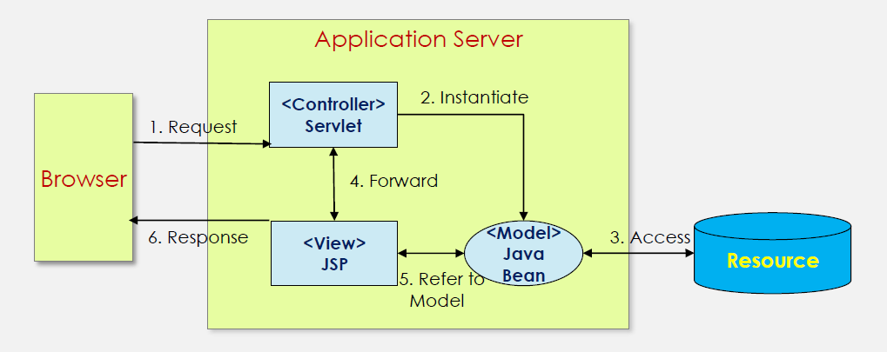

## 서블릿의 장점

- 자바를 기반으로 자바 API를 모두 사용할 수 있다
- 운영체제나 하드웨어에 영향을 받지 않으므로, 한 번 개발된 애플리케이션은 다양한 서버 환경에서도 실행할 수 있다
- 웹 애플리케이션에서 효율적인 자료 공유 방법을 제공한다
- 다양한 오픈소스 라이브러리와 개발도구를 활용할 수 있다

## MVC 패턴

- 모델(Model) : 뷰에 필요한 비지니스 영역의 로직을 처리
- 뷰(View) : 비지니스 영역에 대한 프레젠테이션 뷰(결과 화면)를 담당
- 컨트롤러(Controller) : 사용자의 입력 처리와 화면의 흐름 제어를 담당 -Servlet

## 웹 서버 vs 서블릿 컨테이너

| 구분        | 웹 서버                                                                                               | 서블릿 컨테이너                                                                                                                      |
| ----------- | ----------------------------------------------------------------------------------------------------- | ------------------------------------------------------------------------------------------------------------------------------------ |
| 사용목적    | 웹 서비스를 제공하기 위해 필요한 서버 기반의 소프트웨어다                                             | 서블릿으로 개발된 자바 프로그램을 실행하고 처리하기 위한 서버 기반의 소프트웨어다                                                    |
| 처리 콘텐츠 | HTML, CSS, 자바스크립트, 이미지 파일 등                                                               | 서블릿 클래스                                                                                                                        |
| 실행 방법   | 콘텐츠가 위치한 url 요청에 의해 실행하며 요청할 때마다 매번 디스크에서 읽어 처리한다                  | 서블릿 클래스 정보에 따라 서버에 매핑된 url 정보에 따라 실행하며 컨테이너에 적재된 상태에서 처리한다                                 |
| JSP 실행    | 자체로 처리할 수 없다. 서블릿 컨테이너로 처리를 넘긴다                                                | JSP 자체로 처리할 수 있다                                                                                                            |
| 특징        | 웹 서비스 제공을 위한 다양한 설정을 제공하기 때문에 서버를 유연하게 운영하려면 웹 서버를 사용해야한다 | 컨테이너에 따라 기본적인 웹 서버 기능을 내장하고 있으나 고급 설정이나 성능이 떨어지기 때문에 웹 서버와 병행해서 사용할 것을 권장한다 |
