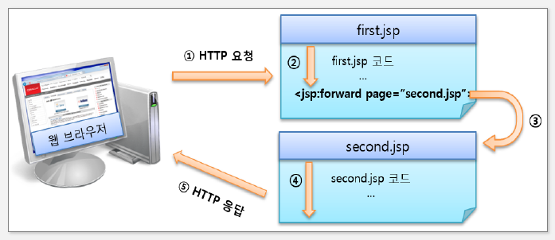

## 액션 태그

- 자바 빈즈 연동 및 동적 페이지 관리를 위한 기능 제공
- 주로 사용하는 액션은 useBean, get/setProperty이며 자바 빈즈와의 연동을 지원

| 액션 태그 주요 기능         | 관련 태그                         |
| --------------------------- | --------------------------------- |
| JSP 페이지 간 흐름 제어     | include, forward, param           |
| 자바 빈즈 컴포넌트 상호작용 | useBean, setProperty, getProperty |
| 자바 애플릿 지원            | plugin                            |

## include 액션태그

- 현재 jsp 페이지의 특정 영역에 외부 파일의 내용을 포함하는 태그
- page 속성
  - 현재 jsp 페이지 내에 포함할 내용을 가진 외부 파일명
- flush 속성(default = false)
  - 설정한 외부 파일로 제어가 이동할 때 지금까지 출력 버퍼에 저장한 결과를 처리
  - true로 설정하면 외부 파일로 제어가 이동할 때 현재 jsp 페이지가 지금까지 출력 버퍼에 저장된 내용을 웹 브라우저에 출력하고 출력 버퍼를 비움
- include 액션태크는 단순히 페이지를 포함하는 것 뿐만 아니라 param 액션태그를 사용하여 포함될 페이지로 파라미터를 전달하는 것이 가능함

## include 액션태그 vs include 지시어

- include 액션태그는 실행 시점에서 해당 파일을 호출하여 그 결과를 포함(정적인 페이지를 포함할 때)
- include 지시어는 해당 파일을 포함시킨 후 컴파일(동적인 페이지를 포함할 때)

| 구분             | include 액션 태그                                                   | include 디렉티브 태그                                                                      |
| ---------------- | ------------------------------------------------------------------- | ------------------------------------------------------------------------------------------ |
| 처리 시간        | 요청 시 자원을 포함                                                 | 번역 시 자원을 포함                                                                        |
| 데이터 전달 방법 | request 기본 내장 객체나 param 액션 태그를 이용하여 파라미터를 전달 | 페이지 내의 변수를 선언한 후 변수에 값을 저장                                              |
| 용도             | 화면 레이아웃의 일부분을 모듈화할 때 주로 사용                      | 다수의 jsp 웹페이지에서 공통으로 사용되는 코드나 저작권과 같은 문장을 포함하는 경우에 사용 |
| 기타             | 동적 페이지에 사용                                                  | 정적 페이지에 사용                                                                         |

## forward 액션태그

- 요청 페이지를 다른 페이지로 전환할 때 사용
- 브라우저 url 창에는 최초 요청 페이지가 표시되기 때문에 처리 페이지 정보를 숨기거나 mvc 패턴의 컨트롤러와 같이 특정 기능 수행 후 다른 페이지로 이동해야 하는 경우 유용하게 사용할 수 있다
- param 액션태그를 사용하여 전환할 페이지로 파라미터를 전달하는 것이 가능

## 자바 빈즈

- 프로그램 모듈화를 위한 컴포넌트 의미
- 동적 콘텐츠 개발을 위해 자바 클래스로 로직을 작성하는 방법
- jsp와 연동하기 위해 만들어진 컴포넌트 클래스이다

## 자바 빈즈 작성 규칙

1. 자바 클래스는 java.io.Serializable 인터페이스를 구현해야 한다(생략 가능)
2. 인수가 없는 기본 생성자가 있어야 한다
3. 모든 멤버 변수인 프로퍼티는 private 접근 지정자로 설정해야 한다
4. 모든 멤버 변수인 프로퍼티는 getter/setter() 메소드가 존재해야 한다

## 자바빈즈 주요 액션 태그

| 액션 태그   | 설명                                                                                                                   |
| ----------- | ---------------------------------------------------------------------------------------------------------------------- |
| useBean     | jsp에서 빈즈 클래스를 사용하기 위한 구문이며 class에 지정된 자바 빈즈 클래스를 id라는 이름으로 사용할 수 있도록 해준다 |
| setProperty | jsp에서 빈즈 클래스의 멤버 변수로 값을 저장하기 위한 구문이다                                                          |
| getProperty | jsp에서 빈즈 클래스의 멤버 변수로 값을 가져오기 위한 구문이다                                                          |

## useBean 액션 태그

- jsp 페이지에서 자바빈즈를 사용하기 위해 실제 자바 클래스를 선언하고 초기화
- id 속성과 scope 속성을 바탕으로 자바빈즈의 객체를 검색하고, 객체가 발견되지 않으면 빈 객체를 생성

| 속성  | 설명                                  |
| ----- | ------------------------------------- |
| id    | 자바 빈즈를 식별하기 위한 이름        |
| class | 패키지 이름을 포함하는 자바 빈즈 이름 |
| scope | 자바 빈즈가 저장되는 영역을 설정      |

## setProperty 액션 태그

- 프로퍼티의 값 저장하기
- useBean 액션 태그와 함께 자바빈즈의 setter() 메소드에 접근하여 자바빈즈의 멤버 변수인 프로퍼티의 값을 저장하는 태그

| 속성     | 설명                                                                                                                             |
| -------- | -------------------------------------------------------------------------------------------------------------------------------- |
| name     | useBean 태그에서 id 속성 값으로 설정된 자바빈즈를 실별하기 위한 이름                                                             |
| property | 자바빈즈의 프로퍼티 이름, 프로퍼티 이름이 \*을 사용하면 모든 요청 파라미터가 자바 빈즈 포로퍼티의 setter()메소드에 전달됨을 의미 |
| value    | 변경할 자바 빈즈의 프로퍼티 값                                                                                                   |
| param    | 자바빈즈의 프로퍼티 값을 전달하는 요청 파라미터의 이름. param과 value를 동시에 모드 사용할 수 없으며 하나를 선택해서 사용 가능   |

## getProperty 액션 태그

- 프로퍼티의 값 가져오기
- useBean 액션 태그와 함께 자바빈즈의 getter() 메소드에 접근하여 자바빈즈의 멤버 변수인 프로퍼티의 값을 가져오는 태그

| 속성     | 설명                                                                                                                             |
| -------- | -------------------------------------------------------------------------------------------------------------------------------- |
| name     | useBean 태그에서 id 속성 값으로 설정된 자바빈즈를 실별하기 위한 이름                                                             |
| property | 자바빈즈의 프로퍼티 이름, 프로퍼티 이름이 \*을 사용하면 모든 요청 파라미터가 자바 빈즈 포로퍼티의 getter()메소드에 전달됨을 의미 |
