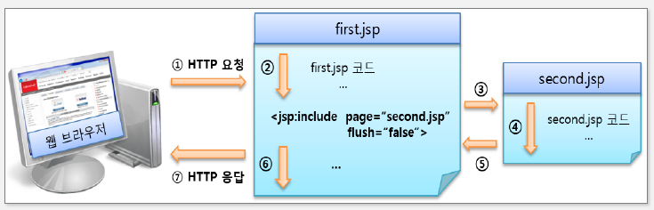

## 액션 태그

- 자바 빈즈 연동 및 동적 페이지 관리를 위한 기능 제공
- 주로 사용하는 액션은 useBean, get/setProperty이며 자바 빈즈와의 연동을 지원

| 액션 태그 주요 기능         | 관련 태그                         |
| --------------------------- | --------------------------------- |
| JSP 페이지 간 흐름 제어     | include, forward, param           |
| 자바 빈즈 컴포넌트 상호작용 | useBean, setProperty, getProperty |
| 자바 애플릿 지원            | plugin                            |

## include 액션태그

- 현재 jsp 페이지의 특정 영역에 외부 파일의 내용을 포함하는 태그
- page 속성
  - 현재 jsp 페이지 내에 포함할 내용을 가진 외부 파일명
- flush 속성(default = false)
  - 설정한 외부 파일로 제어가 이동할 때 지금까지 출력 버퍼에 저장한 결과를 처리
  - true로 설정하면 외부 파일로 제어가 이동할 때 현재 jsp 페이지가 지금까지 출력 버퍼에 저장된 내용을 웹 브라우저에 출력하고 출력 버퍼를 비움
- include 액션태크는 단순히 페이지를 포함하는 것 뿐만 아니라 param 액션태그를 사용하여 포함될 페이지로 파라미터를 전달하는 것이 가능함

## include 액션태그 vs include 지시어

- include 액션태그는 실행 시점에서 해당 파일을 호출하여 그 결과를 포함(정적인 페이지를 포함할 때)
- include 지시어는 해당 파일을 포함시킨 후 컴파일(동적인 페이지를 포함할 때)

| 구분             | include 액션 태그                                                   | include 디렉티브 태그                                                                      |
| ---------------- | ------------------------------------------------------------------- | ------------------------------------------------------------------------------------------ |
| 처리 시간        | 요청 시 자원을 포함                                                 | 번역 시 자원을 포함                                                                        |
| 데이터 전달 방법 | request 기본 내장 객체나 param 액션 태그를 이용하여 파라미터를 전달 | 페이지 내의 변수를 선언한 후 변수에 값을 저장                                              |
| 용도             | 화면 레이아웃의 일부분을 모듈화할 때 주로 사용                      | 다수의 jsp 웹페이지에서 공통으로 사용되는 코드나 저작권과 같은 문장을 포함하는 경우에 사용 |
| 기타             | 동적 페이지에 사용                                                  | 정적 페이지에 사용                                                                         |
