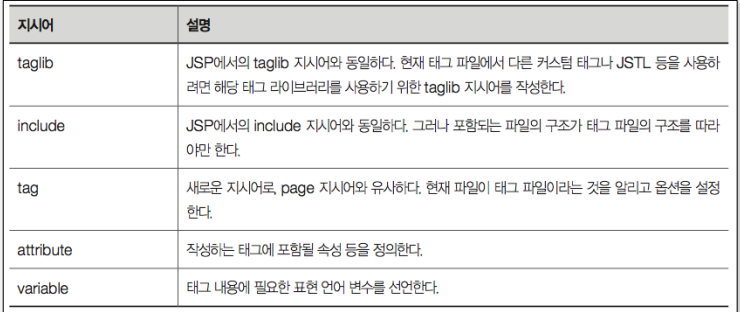
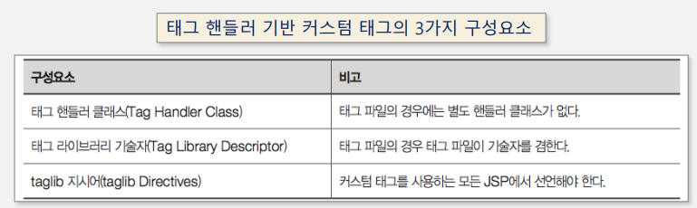
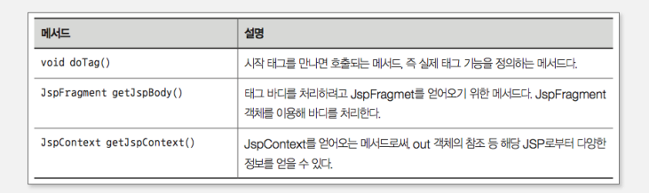

## 표현 언어

표현 언어는 처음 JSTL이 소개되었을 때 나온 것으로, MVC 패턴에 따라 뷰 역할을 수행하는 JSP를 더욱 효과적으로 만들려는 목적으로 개발되었다.

- 스크립트릿과 표현식을 대체
- 지금은 JSP의 기본 스펙에 포함됨

## 표현 언어의 기본적인 문법

- 표현 언어는 '$'로 시작한다.
- 모든 내용은 '{표현식}'과 같이 구성된다.
- 표현식에는 기본적으로 변수 이름, 혹은 '객체\_이름.멤버변수\_이름'구조로 이루어진다.
- 표현식에는 부가적으로 숫자, 문자열, boolean, null과 같은 상수 값도 올 수 있따.
- 표현식에는 기본적인 연산을 할 수 있다.
- 표현식에서 사용되는 데이터는 자바 프로그래밍 언어의 변수 이름이고, 표현 언어에서 사용되는 데이터는 애트리뷰트의 이름으로 해석된다.

## 데이터 이름 하나로만 구성된 표현언어 식

표현언어에 있는 데이터 이름을 해석하는 순서는 사용 범위가 좁은 애트리뷰트부터 점점 더 사용 범위가 넓은 애트리뷰트 순으로 진행된다.


```java
  ${pageScope.RESULT}
  ${requestScope.RESULT}
  ${sessionScope.RESULT}
  ${applicationScope.RESULT}
```

## Param 객체

param은 웹 브라우저에서 FORM 엘리먼트를 통해 입력된 데이터를 jsp 페이지에서 가져올 때 사용하는 내장 객체이다.

```java
  ${param.ITEM}
  ${param["ITEM"]}
```

FORM 엘리먼트를 통해 똑같은 이름의 데이터가 여러 개 입력되는 경우도 있는데, 그럴 때는 paramValues 내장 객체를 사용하면 된다.

```java
  ${paramValues.ITEMLIST[0]}
  ${paramValues["ITEMLIST"][0]}
```

## 표현 언어에서의 연산자

표현 언어에서는 표현식 부분에서 기본적인 연산을 할 수 있다.

## 커스텀 태그

- 원래 JSP 페이지에서 반복적인 프로그램 로직을 캡슐화하기 위해 고안됨
- 기본적으로 제공되는 태그 이외 사용자가 확장한 태그라는 의미에서 붙여진 이름

## 커스텀 태그 라이브러리를 사용했을 때의 장점

1. 비즈니스 로직으로부터 화면 표현을 분리할 수 있다
2. 비즈니스 로직의 캡슐화할 수 있다(재사용할 수 있고 유지보수에 유리하다)
3. 보다 완벽한 MVC 패턴을 구현할 수 있다

## 커스텀 태그를 구현하는 2가지 방법

- 태그 파일 기반의 개발 방법
- 태그 핸들러 클래스 기반 개발 방법 (자바 클래스)

## 태그의 기본 구조

- 일반적인 태그와 동일한 구조를 가진다.
- 태그의 구성 요소는 태그, 속성, 태그 바디가 된다.
  - 태그
  - 속성 : 태그 안에서 부가적인 정보를 제공하는 것
  - 태그 바디 : 시작 태그와 종료 태그 사이에 있는 내용

## taglib 지시어

- 커스텀 태그를 사용하기 위해서는 jsp에 taglib 지시어를 기술해 주어야 한다.
- taglib 지시어는 uri 또는 tagdir 정보와 prefix 정보를 등록한다.

  - uri/tagdir : 파일 경로를 지정한다.
  - prefix : 커스텀 태그를 구분하기 위한 이름(동일한 이름의 태그가 여러 태그 라이브러리에 있을 수 있기 때문에 이를 구분하는 목적)

    - 본문에서 태그를 사용할 때는 prefix:태그\_이름 형태로 사용

    ```jsp
    <prefix:태그_이름>태그 바디</prefix:태그_이름>
    ```

## 태그 파일

- 실제 태그의 기능을 구현한 파일
- JSP 문법과 표현언어, JSTL 등을 자유롭게 사용할 수 있다.
- .tag 파일로서, WEB-INF/tags 폴더에 저장한다.
- 기본적인 JSP 지시어와 추가된 tag, attribute, variable 지시어를 사용할 수 있다.



## 커스텀 태그 body-content 애트리뷰트

- empty : 커스텀 태그 바디에 아무것도 갖지 않도록 한다.
- scriptless : 커스텀 태그 바디 내에 스크립팅 요소(스크립트릿)을 사용할 수 없다.
  - 커스텀 태그 바디 내 내용을 출력하기 위해서는 태그 파일 내에 jsp:doBody 표준 액션을 사용
- tagdependent : 태그 바디내에 스크립팅 요소(스크립트릿)을 사용할 수 있지만 처리되지 않고 텍스트로 취급됨

## 태그 핸들러

- 태그 핸들러란 커스텀 태그를 처리하는 객체를 말한다. 자바 클래스를 이용해 커스텀 태그를 구현하는 방법이다.
- SimpleTag 인터페이스가 제공되면서 SimpleTagSupport 클래스를 상속받아 이전보다는 비교적 쉽게 구현할 수 있게 되었다.

## 태그 핸들러 기반 커스텀 태그의 3가지 구성요소



- 태그 핸들러 클래스 : 커스텀 태그를 실제 구현한 자바 클래스다. 태그 라이브러리 기술자에서 설계된 내용을 구현해야 한다. 태그 파일 기반의 커스텀 태그에서는 필요 없다.
- 태그 라이브러리 기술자
  - xml 규격으로 커스텀 태그에 대한 구조를 정의하는 파일이다.
  - .tld 파일로 만들어지며 태그 기반의 커스텀 태그에서는 필요하지 않다.
- taglib 지시어 : jsp 지시어의 한 종류로, jsp 페이지에 공통으로 필요한 정보를 기술하는 부분이다. 태그 핸들러 기반 커스텀 태그 사용을 위한 태그 라이브러리 기술자의 위치 등을 설정한다.

## 태그 핸들러 클래스 구조

SimpleTagSupport 클래스를 상속받아 자신만의 커스텀 태그를 만들게 된다.



- 실제 개발에 가장 중요한 메서드는 doTag() 메서드로, 태그의 실제 기능을 구현한다.
