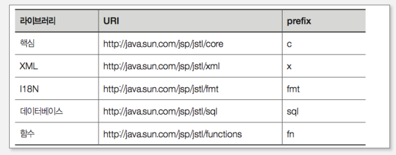

## JSTL

JSTL은 커스텀 태그 라이브러리 기술을 이용해서 일반적으로 필요한 기능들을 표준화한 것으로 크게 핵심, xml, l18N, 데이터베이스, 함수 라이브리러로 구성

- 커스텀 태그 기반이므로 JSTL을 사용하는 방법은 일반 커스텀 태그와 같음

## JSTL 활용

- 간단한 프로그램 로직 구현(for, if 문 ...)
- 다른 JSP 페이지 호출
- JSP 페이지 하나를 가지고 다국어 언어의 웹 페이지 생성
- 데이터베이스의 입력, 수정, 삭제, 조회
- XML 문서의 처리
- 문자열을 처리하는 함수 호출

## JSTL 라이브러리별 URI 및 prefix

## 리스너

톰캣의 특정 이벤트에 동작하는 특수한 목적의 서블릿 프로그램

## c:out

- 초기에는 jsp 표현식(<%=%>)을 대체하기 위해 개발되었으나 표현언어가 JSP에 기본으로 제공 되면서 사용 빈도는 줄었으나 몇몇 옵션은 유용하게 사용됨

- 속성
  - value : 출력될 내용 또는 표현식이다.
  - default : value 값에 내용이 없는 경우에 출력할 내용으로, 태그 바디 혹은 속성 값 형태로 올 수 있다.
  - escapeXml : 출력될 내용에 <,>,&,'," 등의 문자를 일반 문자로 변환할 것인지 결정한다. 예를 들어 출력될 내용에 html 태그가 포함되어 있다면 이값을 false로 해야 태그가 반영된 내용이 화면에 보인다. 만일 true로 할 경우 태그가 그대로 화면에 보이게 된다.

## c:set

- c:set 태그는 변수 값을 설정하거나 객체의 멤버변수 값을 설정할 때 사용
- 속성
  - value : 저장할 변수 값
  - target : 값이 저장될 객체 이름
  - property : target 객체의 멤버변수 이름
  - var : 값이 저장될 변수 이름
  - scope : 값이 저장될 범위(page, session, request, application)

## c:remove

- c:remove 태그는 해당 scope에 설정된 객체를 제거한다
- 속성
  - var : 삭제할 변수 이름
  - scope : 삭제할 범위

## c:catch

- c:catch 태그는 바디에서 실행되는 코드의 예외를 처리한다
- 태그 바디에서 예외사항이 발생하면 메시지가 var로 지정한 변수로 들어간다
- 속성
  - var : 오류 메시지를 저장할 변수 이름

## c:if

- 조건에 따라 바디 내용을 처리한다
- 자바의 if와 비슷하지만 else문은 지원하지 않는다(단순 조건 체그만 가능)
- 속성
  - test : 검사할 조건
  - var : test 조건의 결과를 저장할 변수(결과는 true 혹은 false)
  - scope : 변수가 저장될 범위

## c:choose, c:when, c:otherwise

- 이들 태그는 함께 사용되며 자바의 if~ else if 문, switch 문과 유사하다.
- c:choose 태그 내에는 c:when 태그가 여러 개 올 수 있다.
- 속성
  - test : 검사할 조건

## c:forEach

- 반복문과 관련된 태그로 자바의 for문과 유사하다
- 속성
  - items : 반복을 위한 데이터를 가진 아이템의 컬렉션
  - begin : 반복 시작 번호
  - end : 반복 끝 번호
  - step : 반복의 증가분
  - var : 현재 아이템이 있는 변수
  - varStatus : 반복 상태 값이 있는 변수

## c:forTokens

- for문과 유사한 동작을 하지만 문자열을 토큰으로 구분해 처리하는 기능을 제공
- 자바의 StringTokenizer 클래스와 유사
- 속성
  - items : 반복을 위한 데이터를 가진 아이템의 컬렉션
  - delims : 구분자로 사용할 문자
  - begin : 반복 시작 번호
  - end : 반복 끝 번호
  - step : 반복의 증가분
  - var : 현재 아이템이 있는 변수
  - varStatus : 반복 상태 값이 있는 변수

## c:import

- 특정 URL 페이지를 현재 페이지에 포함시킨다.
- jsp:include 액션과 유사하다
- 동적인 페이지를 포함할 때 사용할 수 있으나 성능 상에 문제가 발생할 수 있다.

## c:url

- 제공된 URL에 파라미터 등을 추가해 프로그램에서 URL 관련 처리를 손쉽게 할 수 있는 기능을 제공
- 파라미터는 c:param 태그를 이용해 추가할 수 있다.
- 속성
  - value : 기본 URL
  - context : 현재 웹 애플리케이션의 컨텍스트 이름
  - var : 포함할 페이지의 내용을 가지는 변수 이름
  - scope : var의 범위

## c:redirect

- response.sendRedirect() 메서드나 jsp:forward 액션과 유사하다
- 지정된 페이지로 요청을 이동시키며 c:param을 통해 파라미터 추가
- 속성
  - url : 현재 페이지 내에 포함시킬 url
  - context : 현재 웹 애플리케이션 컨텍스트 이름

## c:param 태그

- import, url, redirect와 함께 사용된다.
- url에 파라미터를 GET 방식으로 추가한다.
