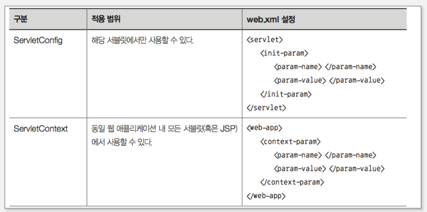
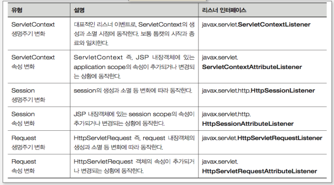

## 초기화 매개변수

- 웹 애플리케이션 초기화 매개변수는 웹 애플리케이션이 컨테이너에 의해 구동될 때 로딩되는 정보로서, 웹 애플리케이션 전반에 걸쳐 공통적으로 참조하는 값을 설정하는 용도로 사용한다.

- 초기화 매개변수는 웹애플리케이션 전체 혹은 특정 서블릿에 대한 값을 설정할 수 있다.

- 초기 값의 설정은 web.xml에서 한다
- 서블릿 초기화 매개변수는 ServletConfig를 통해 접근할 수 있다.
- 웹 애플리케이션 초기화 매개변수는 ServletContext를 통해 접근할 수 있다.



## ServletConfig를 사용하는 경우

- 서블릿 단위로 설정하기 때문에 해당 서블릿에서만 참조할 수 있다

```java
  getInitParameter("param-name에서의 설정 이름");
```

- web.xml 이외에도 서블릿 클래스에 애너테이션 기반으로 초기값을 설정할 수 있다.

## ServletContext를 사용하는 경우

- 웹 애플리케이션 내 모든 JSP 혹은 서블릿에서의 참조가 가능하다.

```java
  getServletContext().getInitParameter("param-name에서의 설정 이름")
```

- 웹 애플리케이션 초기화 매개변수는 web.xml에서 context-param 태그를 이용해 설정할 수 있다.

## 리스너

- 컨테이너에서 발생하는 특정 이벤트 상황을 모니터링하다가 실행되는 특수한 형태의 서블릿이다.

- 웹 애플리케이션에 초기 데이터를 공급하거나 특정 상황에 따라 자동으로 동작하는 프로그램을 구현할 때 사용한다.

- 즉 리스너는 특정 이벤트에 따라 동작하는 인터페이스를 구현한 클래스다.

## 리스너 활용 유형

- 초기화 매개변수와 연동
- 예제 프로그램 등을 배포할 때 샘플 데이터 제공
- 복잡한 환경 설정 제공
- 특정 이벤트에 동작하는 기능 구현

## 리스너 구조와 종류

리스너는 크게 ServletContext, Session, Request의 상태나 속성의 변화를 모니터링하고 동작한다.



## ServletContextListener 기준 리스너 동작 구조

톰캣 시작시 web.xml 혹은 애너테이션 정보를 참조해 ServletContextListener 인터페이스를 구현한 리스너 클래스를 시작한다. contextInitialized() 메서드가 호출되고 여기서 애플리케이션에서 공유할 객체들을 초기화 할 수 있다.

## 필터

필터란 특정 요청에 대해서만 사용자 요청 처리 이전에 먼저 동작하는 특수한 형태의 웹 프로그램을 말한다. 여러 개가 정해진 순서에 따라 배치될 수 있다.

- 리스너는 특정 이벤트에 따라 실행되는 것이고 필터는 사용자가 요청하는 리소스 패턴을 지정해 동작한다는 점이 차이가 있다.

## 필터의 활용

- 인증
- 로깅/감사
- 이미지 변환, 데이터 압축
- 국제화
- XML

## 필터의 구조와 동작 과정

- 톰캣은 시작할 때 web.xml 혹은 애너테이션 정보(@WebFilter)를 참조해 Filter 인터페이스를 구현한 클래스를 찾아 해당 필터를 실행하는 구조이다.

- 필터는 여러 개가 존재할 수 있으며 각각의 필터는 init() 메서드를 통해 초기화 작업을 수행하며 단 한번만 실행된다.

- 필터의 기능 동작은 doFilter() 메서드에서 이루어진다.

- 필터가 여러개라면 하나의 필터가 수행된 다음 필터 체인에 의해 다음 필터가 실행된다.

- 세번째 파라미터인 FilterChain 객체의 doFilter() 메서드를 호출하면 필터 체인의 다음 번 필터 멤버가 호출된다.

## 필터 등록 과정(web.xml)

- 필터 클래스를 web.xml 파일에 등록하려면 루트 엘리먼트인 web-app의 아래에 filter와 filter-mapping이라는 두 개의 엘리먼트를 추가해야 한다

- filter 엘리먼트 안에는 filter-name과 filter-class라는 두 개의 서브 엘리먼트를 써야한다.

- filter-mapping 엘리먼트내에는 filter-name과 servlet-name, url-pattern 중 한 서브엘리먼트를 써야 한다.

- 필터를 특정한 한 웹 컴포넌트에만 적용하고자 할 때는 servlet-name 서브엘리먼트에 해당 웹 컴포넌트의 이름을 지정하면 된다.

- 필터를 여러 개의 웹 컴포넌트에 한꺼번에 적용하고자 할 때는 url-pattern 서브엘리먼트에 해당 웹 컴포넌트들의 url 패턴을 쓰면 된다.

## 필터 클래스의 init 메서드

필터의 초기화 파라미터란 필터 클래스에서 사용할 데이터를 web.xml 파일 안에 이름-값 쌍으로 지정해 놓은 것을 말한다.
